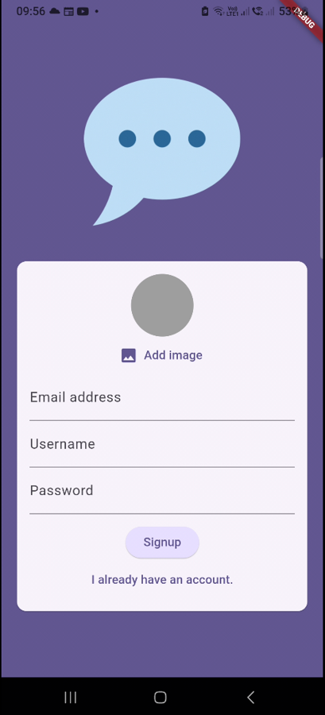
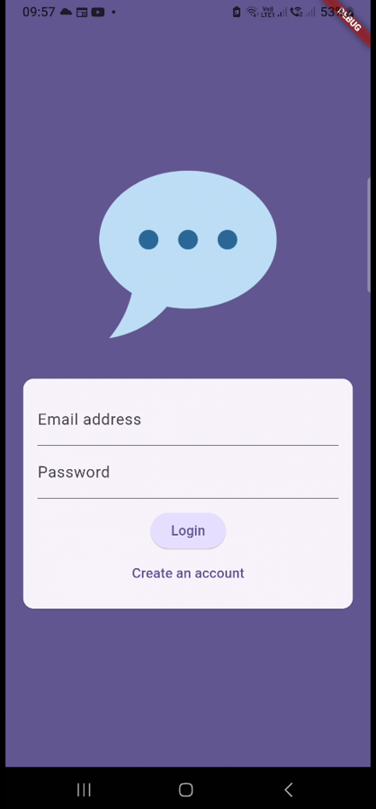
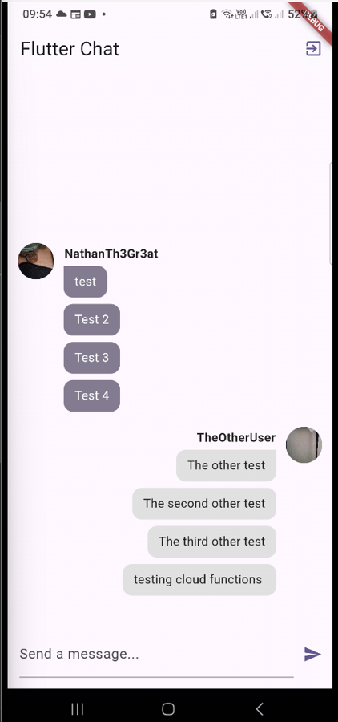

# The Chat App
 

## About:
Allows users to login/sign up to a chat room. Each new user gives an email,password, image( for profile picture) and a username. The profile picture and username are not able to be changed after creation.
All messages are stored on Firebase.
## Features:
  - Notifications (Firebase Messaging)
  - Login/Sign uo with Firebase Authentication
  - Profile pictures are stored in Firebase Storage
  - Chat messages are saved to Firebase Realtime Database
  - Riverpod For state management
## Images: 
<table>
  <tr>
    <th>Screen Name</th>
    <th>Screenshot</th>
  </tr>
  <tr>
    <td><strong>Register Screen</strong></td>
    <td></td>
  </tr>
   <tr>
    <td><strong>Canera Open for Register</strong></td>
    <td></td>
  </tr>
  <tr>
    <td><strong>Login Screen</strong></td>
    <td></td>
  </tr>
  <tr>
    <td><strong>Chat Screen</strong></td>
    <td></td>
  </tr>
 
</table>

